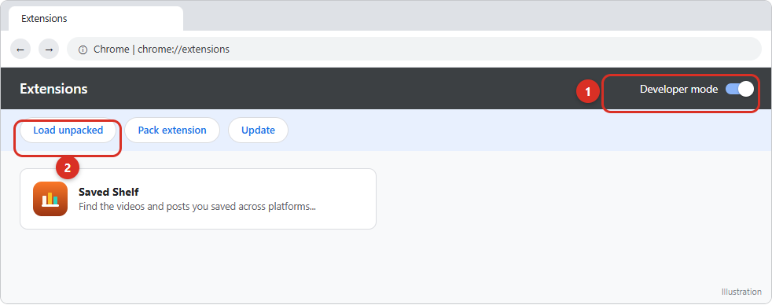
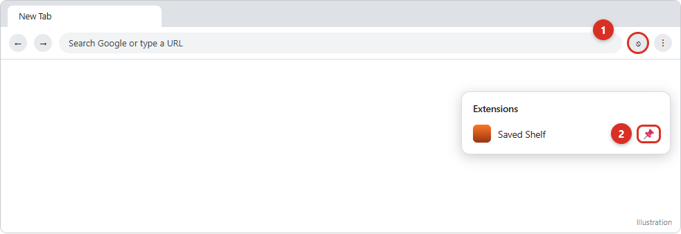
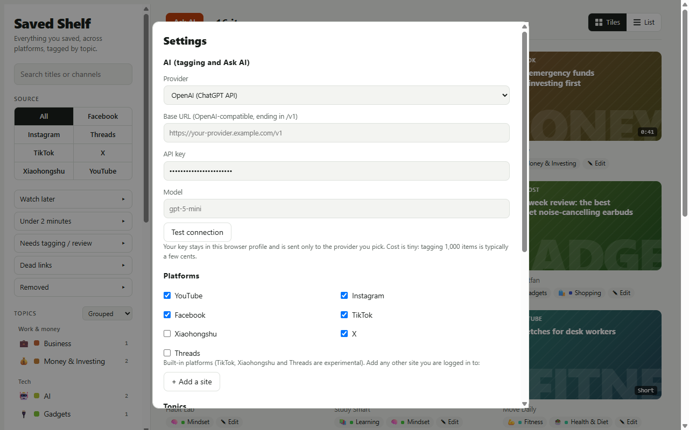
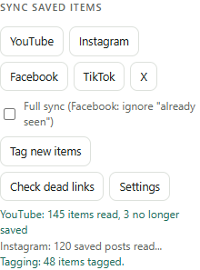
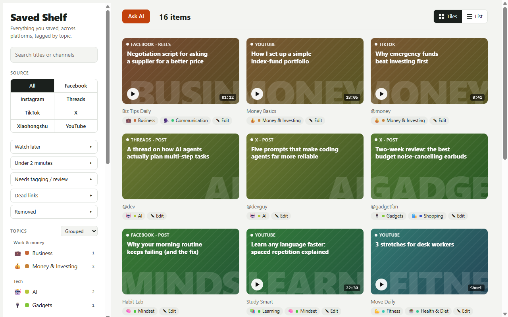
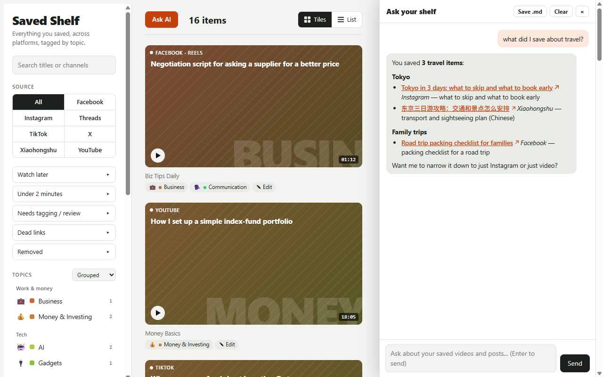

# Install guide

About 5 minutes. You need **desktop Chrome** (or another Chromium browser that supports Manifest V3 extensions, such as Edge or Brave). No account and no coding.

> The two Chrome screenshots in steps 2–3 are **illustrations** of Chrome's own pages (they can look slightly different on your version). The other screenshots are of Saved Shelf itself, using made-up sample items.

---

## 1. Download

1. On the GitHub page, click the green **Code** button, then **Download ZIP**.
2. Unzip it into a folder you will **keep** (for example `Documents\saved-shelf`). Don't leave it in Downloads: Chrome loads the extension *from this folder* every time, so moving or deleting it breaks the extension and loses its saved data.

## 2. Turn on Developer mode

1. In Chrome's address bar type `chrome://extensions` and press Enter.
2. Switch on **Developer mode** (top right, **1**).
3. New buttons appear. Click **Load unpacked** (**2**).

## 3. Load the folder

In the window that opens, choose the **unzipped folder that contains `manifest.json`** (not a file inside it, and not the ZIP), then click **Select Folder**. *Saved Shelf* now appears in your extension list.

Chrome will show the permissions it needs: access to YouTube, Instagram, Facebook, TikTok, Xiaohongshu, X and Threads (so it can read *your* saved pages), and to the AI services you may choose. It only uses a site when you press that site's **Sync** button.

## 4. Pin the icon

Click the puzzle-piece icon at the top right of Chrome (**1**) and the pin next to *Saved Shelf* (**2**), so the Saved Shelf icon is always one click away.

## 5. Open the shelf and choose your AI

Click the Saved Shelf icon. A new tab opens with your (empty) shelf. Click **Settings** (in the left panel, under *Sync saved items*).

- **Provider**: pick any AI service you have an account with: Claude, OpenAI, Gemini, DeepSeek, OpenRouter, Groq, Mistral, a local **Ollama** (free, no key), or **Custom** (any OpenAI-compatible address).
- **API key**: paste your key from that provider's website. It stays in your browser and is sent only to that provider.
- **Model**: leave the suggestion, or type another model name.
- Press **Test connection** to check it works. Tagging about 1,000 items usually costs a few cents with a small, fast model.
- **Platforms**: tick the ones you use. TikTok, Xiaohongshu, X and Threads are **experimental**. Use **Add a site** to connect any other site you're logged in to.
- **Topics**: edit the topic list if you like (one per line). The AI only uses these.
- Click **Save**.

## 6. Sync your saved items

Make sure you're **logged in** to each platform in this same Chrome. Then, in the left panel under **Sync saved items**, press a platform's button. The extension opens that site in a tab and reads your saved items. **Keep that tab open and visible until it finishes.**

Notes:
- **Facebook** is slower and stops after it meets items it already has. Tick **Full sync** if you want it to read everything.
- New items are tagged automatically if you've set up an AI key. You can also press **Tag new items**.
- The first sync of a large list can take several minutes. Platforms may rate-limit you if you sync too often.

## 7. Browse, search, ask

Your shelf now shows everything in one place. Filter by platform or topic, search by title or channel, switch between tiles and a list, or click **Edit** on any item to change its topics.

Click **Ask AI** to chat with your shelf in plain language ("what did I save about travel?"). Answers come back with clickable links that open in a second window, and **Save .md** exports the chat as a Markdown file.

---

## Everyday use

- **Keep up to date**: press the Sync buttons now and then. Use **Check dead links** to find and clear saved items that no longer open.
- **Backup**: **Export JSON** (left panel, bottom) saves everything to a file. **Import JSON** restores it, for example on another computer.
- **Updating Saved Shelf**: replace the files in your folder with the new version, open `chrome://extensions`, and click the circular reload arrow on the Saved Shelf card.
- **Removing it**: `chrome://extensions` → Remove. Export first if you want to keep your data.

## Troubleshooting

| Problem | Try this |
|---|---|
| "Package is invalid" / manifest error when loading | You selected the wrong folder. Pick the one that directly contains `manifest.json`. |
| Sync button does nothing or says "not signed in" | Log in to that platform in this Chrome, then press Sync again. |
| "Found no saved items" on TikTok / Xiaohongshu / X / Threads | These are experimental and the sites change often. Open your saved list manually, press Sync again, or add the site under **Add a site** with CSS selectors. Please open an issue. |
| Tagging says "Add your API key" | Settings → choose a provider, paste the key, **Test connection**. |
| Everything is empty after moving the folder | Chrome ties your data to the folder location. Move it back, or use **Export JSON** before moving and **Import JSON** after. |
| A platform blocks or rate-limits you | Stop syncing for a while. Use a smaller scope (for Facebook, don't tick Full sync). |

## A reminder

Some platforms' terms forbid automated collection. Saved Shelf only reads *your own* saved items from *your own* logged-in session, but you use it at your own risk. See the README.
